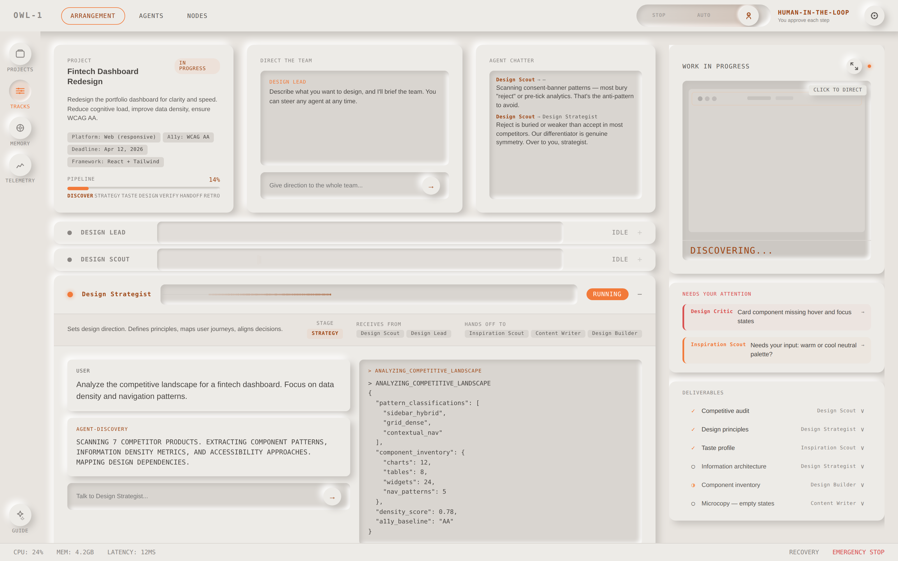
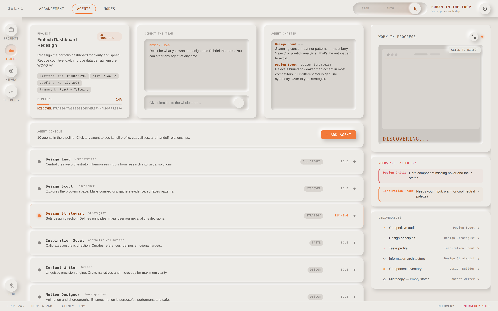
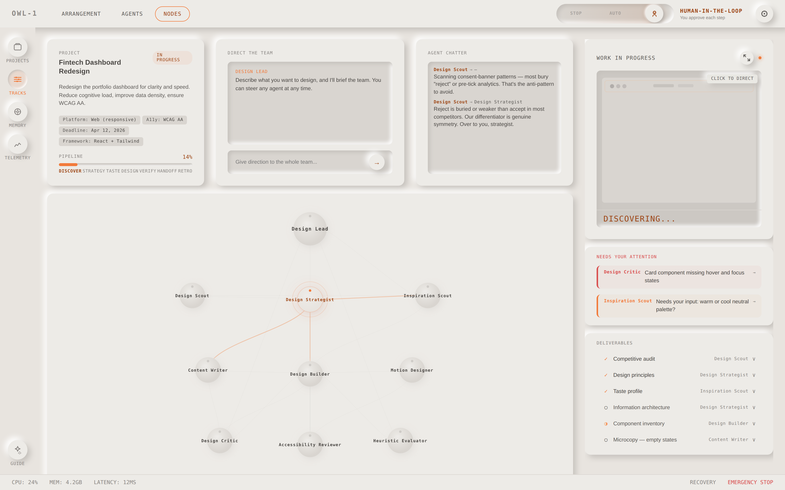

# OWL-1

A workstation for directing AI design agents. Built by MC Dean.



OWL-1 borrows from the language of digital audio workstations: your design agents are tracks, the pipeline is a transport, and the whole system runs on a shared clock. The result is a UI where you direct a real team of ten [Designpowers](https://github.com/Owl-Listener/designpowers) agents — watch them work, intervene when they need you, and stay oriented in a complex creative process that delivers real design work.

## Run it

OWL-1 drives a real team of 10 Designpowers agents (vendored in `vendor/designpowers/`) through the Claude Agent SDK. Describe what you want, watch the team work in real time, approve each handoff, and steer any agent along the way.

```bash
npm install
export ANTHROPIC_API_KEY=sk-ant-...
npm start                    # open http://localhost:4318/?source=live
```

**→ Full walkthrough: [QUICKSTART.md](QUICKSTART.md)** (prerequisites, how to direct, troubleshooting).

Want to look around without a key (or any spend)? `npm run demo` runs the same UI on a scripted offline mock — same lanes, babble, and approval gates, no agents, no cost.

### How it works

OWL-1 (front end) and Designpowers (agents) talk over the **OWL Agent Protocol** ([`docs/owl-agent-protocol.md`](docs/owl-agent-protocol.md)). The backend runs Designpowers headless via the Claude Agent SDK and translates the live run into OAP events the UI renders; OWL-1's **APPROVE** button is the SDK's per-handoff permission gate — a `PreToolUse` hook that pauses each subagent dispatch until you approve. Backend internals live in `spike/oap-gate/`.

## What's in here

```
owl-1/
  src/
    main.jsx                # React entry point
    owl-1-prototype.jsx     # The full OWL-1 interface (single file)
    oap/                    # OWL Agent Protocol client — live event source for the UI
  spike/oap-gate/           # The backend: real Claude Agent SDK runner + server (+ offline mock)
  vendor/designpowers/      # The 10-agent Designpowers team — agents, skills, vendored in
  scripts/
    setup-designpowers.mjs  # Lays out the workspace the SDK loads Designpowers from
  docs/
    owl-agent-protocol.md   # The OWL Agent Protocol — backend ↔ UI contract
    design-brief.md         # Original design brief
    design-critique.md      # Design critique notes
    component-spec.md       # Component specification
  QUICKSTART.md             # Designer quickstart
  index.html                # Vite entry (loads Google Fonts)
  package.json              # React 18 + Vite 5 + Claude Agent SDK
```

## Running it

Real agents (see [QUICKSTART.md](QUICKSTART.md)):

```bash
npm install
export ANTHROPIC_API_KEY=sk-ant-...
npm start            # http://localhost:4318/?source=live
```

Offline preview — the same UI on simulated data, no key, no cost:

```bash
npm install
npm run demo         # scripted mock backend, http://localhost:4318/?source=live
# or: npm run dev    # the raw UI with built-in sample data, http://localhost:5173
```

## Building

```bash
npm run build
```

## The design

Neomorphic surfaces on warm grey. Three-size type scale (9/11/14). JetBrains Mono throughout. Synthesized sound design via Web Audio API. Light and dark mode. Every design decision is in the code, there's no separate design file.

Ten agents, each with a proper name: Design Lead, Design Scout, Design Strategist, Inspiration Scout, Content Writer, Motion Designer, Design Builder, Design Critic, Accessibility Reviewer, Heuristic Evaluator.

Three transport modes: Auto (agents run freely), Human (you approve each step), Stop.

## Views

**Arrangement** is the main workspace: agent swim lanes with live waveforms, a project header with agent banter, deliverables, and blockers that route you to the right agent with a clear CTA.


**Agents** is the full directory: profiles, capabilities, handoff maps, pipeline stage, and management controls for each agent.



**Nodes** is a spatial view of the agent network: who hands off to whom, with particles flowing along active edges.



The left nav gives you Projects, Tracks, Memory (editable taste profile and design context), and Telemetry (token usage, cost, latency). Guide lives at the bottom.

## Status

Working alpha. `npm start` drives live Designpowers agents via the Claude Agent SDK and produces real design work — validated against live runs: agents dispatch (the SDK's `Agent` tool), the OWL-1 lanes light up, the Human-mode APPROVE button holds and resumes a real handoff (via a `PreToolUse` hook), subagent output streams back as babble (via `SubagentStop`), and the team writes real work into `.dp-workspace/design-state.md`.

Still being wired up: agent-*initiated* questions are skipped for now (you steer via the chat instead), and the right-panel blockers, deliverables, and telemetry show sample data rather than live data. Real and usable — not yet hardened.
